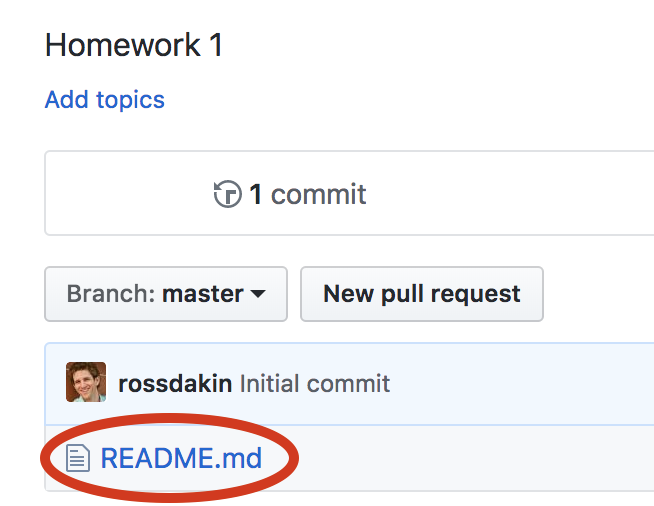
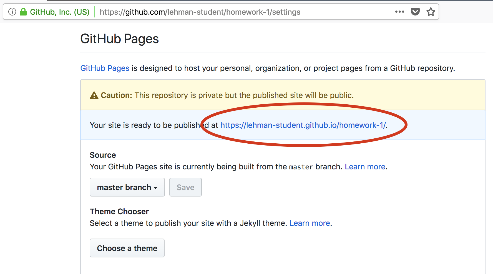
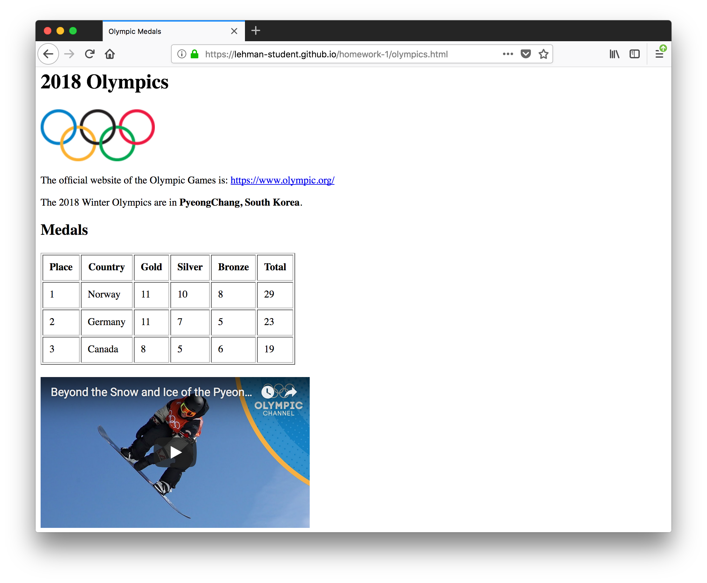

# Homework 1

This homework assignment covers the content that we discussed in class up until and including February 5.

## GitHub

We will exlusively use GitHub for all assignments in this class. Therefore (and because it is broadly used in industry), you should familiarize yourself with GitHub and its features.

### 1. Learn about GitHub

Perform this "Hello World" exercise: https://guides.github.com/activities/hello-world/

### 2. Understand Markdown

[Markdown](https://en.wikipedia.org/wiki/Markdown) is a language for simple text formatting. Usually, markdown files end in `.md` (like this file, `README.md`).

You will complete this homework assignment by modifying this Markdown file (`README.md`).

Take a look at these resources to understand Markdown basics:

* https://help.github.com/articles/basic-writing-and-formatting-syntax/
* https://guides.github.com/features/mastering-markdown/
* https://github.com/adam-p/markdown-here/wiki/Markdown-Cheatsheet

### 3. Modify README

Read about the `README.md` file: https://help.github.com/articles/about-readmes/

Now, edit the `README.md` file in this homework repository by clicking the `README.md` file in the list of files:

Then click the pencil icon to edit it:

Next, edit this line to add your name: Hashmat Ibrahimi

Click the "Preview changes" tab to see your changes.

When you are happy with your changes, click the "Commit changes" button at the bottom (optionally entering a commit title and description):

You should now see your name above (instead of "Your Name"). You can also see your change in the repository's commit history.

### 4. LinkedIn profile URL

[LinkedIn](linkedin.com) is a professional networking site used by almost all companies and recruiters. By establishing your professional profile now, to can begin to connect with other classmates and build your professional network.

Please sign up for LinkedIn and share your LinkedIn profile URL here. If you do not wish to be a member of LinkedIn, please write "I decline.":

[My LinkedIn Profile](https://www.linkedin.com/in/hashmat-ibrahimi-0aa660160)

### 5. Setup GitHub Pages

[GitHub Pages](https://pages.github.com/) is a feature of GitHub that lets you serve webpages directly from a GitHub repository.

You will need to do this once for each homework assignment and class project.

Click the "Settings" tab in your repository:

Enable GitHub Pages on the master branch:

After saving, note the public URL of your repository -- you will use this in the "Writing Code" section below:

## The Web

Please edit this file to add your answers to the following questions.

### URLs

#### 5. In the following URL: `https://www.nsnsp.org/commitments?date=2017-12-09`

* What is the scheme/protocol?
    --- http://
* What is the host?
    ---- www.nsnsp
* What is the port number?
    --- 80
* What is the path?
    --- commitments
* What are the query parameters?
    ---date=2017-12-09
* What is the fragment?
    ---- there is none

#### 6. In the following URL: `http://localhost:4000/admin?`

* What is the scheme/protocol?
    ---https://
* What is the host?
    ---localhost
* What is the port number?
    --- 4000
* What is the path?
    --- admin
* What are the query parameters?
    --- ? (none)
* What is the fragment?
    --- no fragment 

#### 7. In the following URL: `http://www.lehman.edu/academics/mathematics-computer-science/index.php`

* What is the scheme/protocol?
    https://
* What is the host?
    www.lehman.edu
* What is the port number?
    80
* What  is the path?
    /academics/mathematics-computer-science.index.php
* What are the query parameters?
    none
* What is the fragment?
    none

#### 8. In the following URL: `https://en.wikipedia.org/wiki/Greek_alphabet#Glyph_variants`

* What is the scheme/protocol?
    https
* What is the host?
    wikipedia.org
* What is the port number?
    80
* What is the path?
    /wiki/Greek_alphabet
* What are the query parameters?
    - none
* What is the fragment?
    Glyph_variants

### 9. HTTPS

What does the S stand for in HTTPS?
    Secure network
Why is HTTPS better than HTTP?
    https helps enctypt the data so that it is dificult to hack/sniff
Should all web pages use HTTPS?
    it is recomended as we need more security with our websites 

## Webpages

Pleaes ensure you have read chapters 1–9 (except 7) in the [HTML & CSS book](https://isbndb.com/book/9781118008188) or similar information available from MDN here:

* https://developer.mozilla.org/en-US/docs/Web/HTML
* https://developer.mozilla.org/en-US/docs/Web/Tutorials

### 10. What is a webpage?

    a hypertext document connected to the world wide web

### 11. Webpage I like

What's one webpage you like? Why?
    i like apple.com because of the fluidity of the css properties and the amount of work that was put into it 

### 12. Website I don’t like

What's one webpage you like? Why?
    i dont like ebay's website because it looks poorly maintained and follows the theory of if it works then we leave it style wise 

### 13. Resources

Where is a good place to look for information about HTML tags?
    www.w3.org

### 14. HTML Versions

Which version of HTML are we covering in this class? What is it's DOCTYPE tag?
    HTML5 and a doctype a tag that lets the browser know what document type to render

What is XML?
    a metalanguage which allows users to define their own customized markup languages

What is XHTML?
    EXtensible HyperText Markup Language : so it allows the extendability of xml to html

### 15. HTML

Are web pages ASCII (plain text) files, or compiled (binary) files like an executable program?

    they are mostley compiled binary files 

Are HTML files interpreted or executed?
        html files are interpreted files as the browser interprets the texf and reders accordingly to its own libraries and engines

### 16. Browser versioning

Which versions of Microsoft Internet Explorer support the `<nav>` tag?
        IE9

### 17. HTML Validity

What is one tool that can tell you if you have written valid HTML?
    IDE they cover syntaxual proofing

### 18. Accessibility

What does "Accessibility" mean in the context of web development?
        Accessibility refers to the ability of a website to be able to adapt to a persons disabilty allowing them to still understand the data that is presented in the webpage

What types of people does accessibility concern?
    people with disabilties

What is one tool you can use to verify the accessibility of your websites?
    access the browsers accesibility features

### 19. head / body

What is the `<head>` tag for?
    for linking css style sheets and applying to the tab reaigion and guiding how the page should be layed out before it is rendered

What is the `<body>` tag for?
    what the page is to render when it is fully loaded 

### 20. Head…

What's the difference between `<head>`, `<header>`, and heading tags?

    head tags - apply to aspects of the page 
    header tag is a section of the webpage typically above the body portion of the webpage 

### 21. Tables

What are all the tags associated with [HTML tables](https://developer.mozilla.org/en-US/docs/Learn/HTML/Tables) (e.g. `<table>`, `<tr>`, etc.)?
    <caption>, <col>, <colgroup>, <thead>, <tfoot>, and <tbody>, <tr>, <th>, <td>

### 22. Non-closing tags

Which tags don't have a closing pair (e.g. ` `)?
    html, head, body, p, dt, dd, li, option, thead, th, tbody, tr, td, tfoot, colgroup

### 23. Links

How do you make a link open in a new window?
    using the property of href="'

### 24. IFRAME

What is an IFRAME?
    its a webpage inside a webpage 

What are IFRAMEs commonly used for?
    to apply certain elements of a webpage to be active in your webpage 

## Writing Code

In this section, you'll modify a couple HTML files that have been started for you in this repository.

Because you enabled GitHub Pages above, you can actually view these pages in your browser. Use the GitHub Pages URL that you noted above to open these pages in a web browser.

### 25. science.html

Please modify the [science.html](./science.html) file in this repository to make the resulting webpage look like this:

### 26. olympics.html

Please modify the [olympics.html](olympics.html) file in this repository to make the resulting webpage look like this:

## Misc.

### 28. Pace check

Class is going… too slow / just right / too fast.
    a bit slow to be honest and i wish we could learn more about react, but i understand that there arent as much experienced students.

### 28. Jobs

Add a link to one web development job based in NYC:

    ...
What do you still need to learn to meet the requirements?
    angular 2/react js